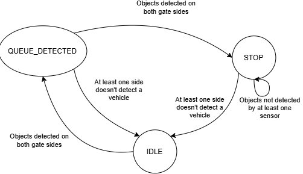

# Traffic Congestion Prevention

## Module Description
Monitors the vehicle queue at the parking lot entrance. When a queue is detected (vehicles backing up beyond a threshold), this module signals the entrance gate and external traffic systems to stop admitting vehicles, preventing congestion from spilling onto adjacent roads.

---

## Assigned Member
Robert

## Language Used
Arduino C++

## Hardware/Device
An ESP32 S3 

## Sensors/Components
-Two breaker beam sensors

---

## FSM States

| State | Description | Number|
|-------|-------------|-------|
| `IDLE` | No queue detected — normal traffic flow allowed | 0 |
| `QUEUE_DETECTED` | Queue length exceeds threshold — begin congestion response | 1 |
| `STOP` | Halt new vehicle admittance; signal external traffic system to redirect | 2 |

### State Transition Diagram

---

## Interface/Communication
This module sends a DC signal to entrance gate module to tell it to not open when there is a vehicle detected on both sides of the gate

---

## How to Run/Build

### 1. Get a 5V and a 3.3V DC power source. 
- If you are not able to get a 3.3V DC power source, you can also use the esp32 s3 dev board for it. 
### 2. Connect the following S3 dev module pins to the elements below: 

- **Pin 1:** The output signal from the front breaker beam setup
- **Pin 2:** The output signal from the rear breaker beam.
- **Pin 41:** A red LED for the stop signal
- **Pin 40:** An LED of any color
    - This LED is the most significant bit representing the state of the congestion prevention FSM
- **Pin 39:** Another LED of any color
    - This LED is the Least significant bit representing the FSM state value

### 3. Connect the ESP32 to a 5V power source, and the sensor components to a 3.3V power source.
### 4. Flash the code to the ESP
